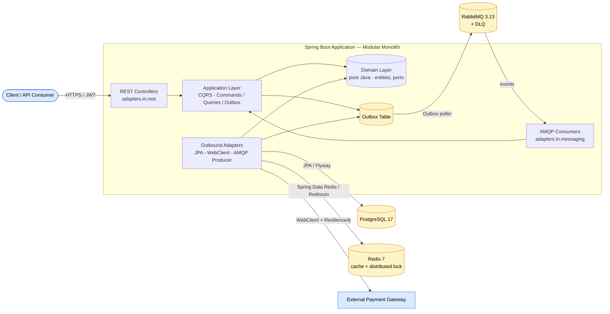
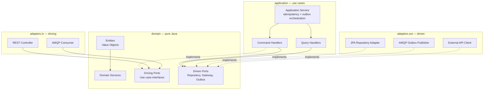

# Distributed Event-Driven Payment &amp; Order Processing Engine

> A production-grade backend showcase built with **Java 21** and **Spring Boot 3**, demonstrating how to solve the hard problems of a modern e-commerce / fintech platform: high traffic spikes, asynchronous transaction processing, partial network failures, concurrent data modifications, and strict consistency requirements under eventual consistency.

[](https://github.com/Kaksi3118/java-payment-order-engine/actions)
[](https://openjdk.org/)
[](https://spring.io/projects/spring-boot)
[](https://maven.apache.org/)
[](https://github.com/Kaksi3118/java-payment-order-engine)
[](./LICENSE)

---

## Current Status

The project is under active development, built stage by stage with verified commits. The table below tracks what's been built and what's next.

| Area | Status | Details |
| --- | --- | --- |
| Project scaffold | ✅ Done | Multi-module Maven reactor, hexagonal package layout, Maven Wrapper 3.9.9, `docker-compose.yml` (Postgres 17 + Redis 7 + RabbitMQ 3.13), `.gitignore`, `.editorconfig`, `.gitattributes`, PR template |
| Shared Kernel | ✅ Done | `Money` (HALF_EVEN), typed UUIDs (`OrderId`, `PaymentId`, `UserId`, `TransactionId`), `AggregateRoot`, `DomainEvent`, `EventOutbox` port |
| ArchUnit guardrails | ✅ Done | 8 active rules: domain purity (no Spring/JPA/Jackson/SLF4J), domain→application forbidden, domain→adapters forbidden, application→adapters forbidden, adapters.in→adapters.out forbidden, cross-context isolation (order↔payment↔identity) |
| Identity domain | ✅ Done | `User` aggregate (PENDING→ACTIVE→SUSPENDED/DEACTIVATED state machine), `Email`, `PasswordHash`, `Role`, `Roles`, `UserStatus`, `JwtTokens`, 3 domain exceptions, driving ports (`RegisterUserUseCase`, `AuthenticateUserUseCase`), driven ports (`UserRepository`, `PasswordHasher`, `JwtIssuer`) |
| Identity application | ✅ Done | `RegisterUserService` (transactional outbox orchestration), `AuthenticateUserService` (read-only, no user enumeration) |
| Identity security adapters | ✅ Done | `BcryptPasswordHasher` (BCrypt with randomized salt), `JwtIssuerAdapter` (RS256 JWT with access/refresh token split + `typ` discriminator), `SecurityConfig` (stateless OAuth2 resource server), `JwtConfig` (RSA-2048 keypair + encoder/decoder beans), `JwtProperties` (validated TTL config) |
| Identity persistence adapters | ✅ Done | JPA `UserEntity` + `UserRepositoryAdapter` (load-then-update preserving `@Version`), `OutboxEntity` + `OutboxAdapter` (JSON-serialized events with PENDING status), Flyway V1 migration (`users`, `user_roles`, `outbox_events`) |
| Identity REST controllers | ✅ Done | `AuthController` (`POST /api/auth/register` with `Idempotency-Key` header, `POST /api/auth/login`), `GlobalExceptionHandler` (domain exceptions → HTTP 409/401/403/400), Bean Validation on request DTOs |
| Identity integration tests | ✅ Done | `IdentityIT` (5 tests) with Testcontainers + PostgreSQL 17 — register/outbox/activate/authenticate/duplicate end-to-end. Skipped automatically when `DOCKER_HOST` is not set |
| Order domain | ✅ Done | `Order` aggregate (CREATED→CONFIRMED→SHIPPED→DELIVERED / CANCELLED state machine), `OrderItem`, `OrderView` (CQRS), `OrderPlaced`/`OrderConfirmed`/`OrderCancelled` events, driven ports (`OrderRepository`, `InventoryPort`, `IdempotencyPort`), driving ports (`PlaceOrderUseCase`, `CancelOrderUseCase`, `GetOrderQuery`), 3 domain exceptions |
| Order application | ✅ Done | `PlaceOrderService` (idempotency guard → inventory reservation → order placement → outbox drain), `CancelOrderService` (load → cancel → inventory release → outbox drain), `GetOrderQueryHandler` (CQRS read-only) |
| Order persistence adapters | ✅ Done | JPA `OrderEntity` with `@Version` optimistic locking, `OrderRepositoryAdapter` (load-then-update), `IdempotencyEntity` + `IdempotencyAdapter` (DB-backed with UNIQUE constraint), `InMemoryInventoryAdapter` (in-process stub), Flyway V2 migration (`orders`, `order_items`, `idempotency_keys`) |
| Order REST controllers | ✅ Done | `OrderController` (`POST /api/orders` with `Idempotency-Key`, `POST /api/orders/{id}/cancel`, `GET /api/orders/{id}` CQRS read), `OrderExceptionHandler` (domain exceptions → HTTP 404/409/400) |
| Order integration tests | ✅ Done | `OrderIT` (6 tests) with Testcontainers — place/idempotency-replay/insufficient-inventory/cancel/cancel-not-found/get-not-found end-to-end |
| Payment bounded context | 📋 Planned | Domain (Transaction aggregate), application (AuthorizePayment, CapturePayment, RefundPayment), adapters (WebClient + Resilience4j gateway client), REST controllers |
| RabbitMQ wiring | 📋 Planned | DLQ topology, outbox poller with Redis distributed lock, event consumer for cross-context communication |
| Observability | 📋 Planned | Micrometer + Prometheus + Grafana dashboards |
| CI/CD | 📋 Planned | GitHub Actions workflow |

**Test count:** 151 tests green (`./mvnw clean verify` → BUILD SUCCESS) — 34 shared-kernel + 69 identity + 40 order + 8 ArchUnit architecture rules + 11 integration tests (skipped without Docker).

---

## Why this project?

Most portfolio backends are CRUD apps with a thin REST layer over JPA. This project intentionally reaches for the same architectural patterns used in production payment systems at scale, so that the hard parts — and how to reason about them — are visible in the code:

| Production challenge | How this project demonstrates it |
| --- | --- |
| Reliable event delivery without 2PC | **Transactional Outbox Pattern** — DB writes and event publication succeed or fail atomically; a poller drains the outbox to RabbitMQ. |
| Duplicate processing on client retry | **Idempotency-Key** header + persisted idempotency context for all state-changing financial operations (no double-charging). |
| Concurrent inventory / balance mutation | Multi-layer concurrency control: **JPA optimistic locking** (`@Version`) + **pessimistic locks** for hot paths, augmented by **Redis distributed locks** (Redisson). |
| Decoupling heavy work from the request path | **CQRS** + **asynchronous messaging via RabbitMQ** with explicit DLQ topologies and retry/backoff semantics. |
| Cascading failure from a flaky third-party API | **Resilience4j**: circuit breaker, bulkhead, rate limiter, retry — around the external payment gateway. |
| High throughput on a blocking I/O stack | **Java 21 virtual threads** (`spring.threads.virtual.enabled=true`) — JDK-level carrier scheduling, no reactive rewrite. |
| Trustworthy integration tests | **Testcontainers** spins up **real** PostgreSQL, Redis, and RabbitMQ in Docker — no in-memory mocks. |
| Boundary discipline at scale | **Hexagonal architecture** with **ArchUnit** tests that fail the build if the `domain` layer ever imports Spring/JPA. |

---

## Architecture

### High-level system topology



### Hexagonal / Ports &amp; Adapters (per bounded context)



---

## Tech Stack

| Concern | Choice |
| --- | --- |
| Language / Framework | Java 21 (records, pattern matching, virtual threads) + Spring Boot 3.4.1 |
| Persistence | PostgreSQL 17 + Flyway 10 (forward-only migrations) + Spring Data JPA |
| Caching &amp; distributed locks | Redis 7 + Redisson |
| Messaging | RabbitMQ 3.13 + Spring AMQP (with explicit DLQ topology) |
| Resilience | Resilience4j (circuit breaker, retry, rate limiter, bulkhead) |
| Security | Spring Security + JWT (stateless) + RBAC |
| Testing | JUnit 5, AssertJ, Mockito, Testcontainers (real Postgres/Redis/RabbitMQ), ArchUnit |
| Observability | Micrometer + Prometheus + Grafana dashboards |
| CI/CD | GitHub Actions |
| Build | Maven 3.9.x multi-module reactor (with Maven Wrapper) |

---

## Repository Structure

```
java-payment-order-engine/
├── pom.xml                         # parent reactor (BOM imports, plugin management)
├── docker-compose.yml              # PostgreSQL + Redis + RabbitMQ
├── shared-kernel/                 # cross-context primitives: Money, IDs, DomainEvent
├── modules/
│   ├── identity/                  # JWT auth + RBAC
│   ├── order/                     # order lifecycle, outbox, idempotency
│   └── payment/                   # payment + gateway client + Resilience4j
├── bootstrap/                     # Spring Boot main + wiring + application.yml
└── docs/architecture/             # ADRs + diagrams
```

Each bounded context module internally follows the same hexagonal package layout:

```
com.engine.<context>/
├── domain/
│   ├── model/        entities + value objects (pure Java, no framework imports)
│   ├── event/        domain events
│   ├── service/      pure domain services
│   └── port/
│       ├── in/       driving ports — use case interfaces (REST/AMQP call these)
│       └── out/      driven ports — repository, gateway, outbox interfaces
├── application/
│   ├── command/      CQRS write side — commands + handlers
│   ├── query/        CQRS read side — queries + read models
│   └── service/      orchestration: outbox dispatch + idempotency guard
└── adapters/
    ├── in/           REST controllers, @RabbitListener consumers
    └── out/          JPA repositories, AMQP publisher, external HTTP client
```

---

## Quick Start

### Prerequisites

- **Java 21** (Temurin recommended)
- **Docker** + Docker Compose (with the Docker daemon running)
- **Git**

> The Maven Wrapper (`./mvnw`) is bundled — you do **not** need a local Maven install.

### 1. Start the infrastructure

```bash
docker compose up -d
```

This spins up PostgreSQL (5432), Redis (6379), and RabbitMQ (5672 + management UI at http://localhost:15672 — login `poe` / `poe_dev_password`).

### 2. Build &amp; run the application

```bash
./mvnw clean verify          # runs unit + integration tests via Testcontainers
./mvnw -pl bootstrap spring-boot:run
```

The API is now available at `http://localhost:8080`.

### 3. Stop the infrastructure

```bash
docker compose down -v       # -v also drops the volumes for a clean slate
```

---

## Complex Engineering Problems — Solved

### 1. Transactional Outbox Pattern

Database updates and event publication must succeed or fail together. We do **not** use a JTA / 2PC distributed transaction — it is operationally complex and slow. Instead, every command writes its business state and an outbox row in the **same** local DB transaction. A separate poller leases outbox rows (using Redis distributed locks to ensure a single dispatcher across instances) and publishes them to RabbitMQ, marking each row `PUBLISHED` only after the broker confirms. At-least-once delivery + idempotent consumers = effectively-once processing.

### 2. Idempotency Pattern

All POST/PUT endpoints that mutate financial state accept an `Idempotency-Key` header. The application layer stores the key alongside the request hash and the resulting response. A replay of the same key returns the original result without re-executing the side effect — protecting against network retries and double-charging.

### 3. Concurrency Control

Three layers, each addressing a different failure mode:
1. **JPA `@Version` (optimistic locking)** — fails fast on stale reads; the request layer retries with backoff.
2. **Pessimistic `SELECT ... FOR UPDATE`** — for hot inventory rows where contention is high and retry is expensive.
3. **Redisson distributed lock** — the cross-instance coordinator for the outbox dispatcher and inventory flash sales.

### 4. CQRS

Writes (commands) and reads (queries) are segregated down to the handler level. This allows read models to be optimized independently (denormalized projection tables, Redis cache) and keeps the write side focused on consistency invariants.

### 5. Resilience4j around the external gateway

Circuit Breaker (transitions OPEN after a configurable failure rate, half-open to probe recovery), Retry (exponential backoff with jitter, only for idempotent or safely-retriable operations), and Rate Limiter (protect both us and the gateway from overload).

### 6. Virtual Threads

`spring.threads.virtual.enabled=true` makes Tomcat park blocked request threads on virtual carriers, so a blocking JPA/AMQP/Redis call does not consume a platform thread. Throughput rises dramatically without a reactive rewrite.

---

## Build Commands

```bash
./mvnw clean verify            # full build + integration tests (Testcontainers)
./mvnw -pl modules/order test  # tests for a single module
./mvnw -DskipTests package     # compile + package only
./mvnw dependency:tree         # inspect resolved versions
```

---

## Roadmap

### Completed

- [x] **Stage 1** — Repository scaffold, hexagonal module layout, parent POM, `docker-compose.yml`, Maven Wrapper, repo-quality files.
- [x] **Stage 2** — Shared Kernel (`Money`, typed IDs, `DomainEvent`, `AggregateRoot`) + ArchUnit guardrails (8 rules).
- [x] **Stage 3a** — Identity domain layer (`User` aggregate, value objects, ports, events, state machine).
- [x] **Stage 3b** — Identity application layer (`RegisterUserService`, `AuthenticateUserService`, `EventOutbox` port).
- [x] **Stage 3c-i** — Identity security adapters (BCrypt hasher, RS256 JWT issuer, Spring Security config).
- [x] **Stage 3c-ii** — Identity persistence adapters (JPA entity + repository adapter, outbox entity + adapter, Flyway V1 migration).
- [x] **Stage 3c-iii** — Identity REST controllers + `Idempotency-Key` enforcement + global exception handler.
- [x] **Stage 3c-iv** — Testcontainers integration tests (`IdentityIT`).
- [x] **Stage 4a** — Order domain layer (`Order` aggregate, state machine, `OrderItem`, `OrderView` CQRS, events, ports, exceptions).
- [x] **Stage 4b** — Order application layer (`PlaceOrderService` with idempotency + inventory + outbox, `CancelOrderService`, `GetOrderQueryHandler`).
- [x] **Stage 4c** — Order adapters (JPA persistence with `@Version`, REST controllers with `Idempotency-Key`, DB-backed idempotency store, in-memory inventory adapter, Flyway V2 migration).
- [x] **Stage 4d** — Order integration tests (`OrderIT` with Testcontainers).

### Remaining — Detailed Guide for Continuation

The following stages complete the project. Each stage follows the same sub-staged pattern used for Identity and Order: **domain → application → adapters → integration tests**. Read `AGENTS.md` before starting — it encodes the architecture invariants and build commands.

#### Stage 5 — Payment Bounded Context

The Payment context is the most technically impressive module. It integrates with an external payment gateway via WebClient + Resilience4j.

**Stage 5a — Payment domain:**
- `Transaction` aggregate: `TransactionId` (already in shared-kernel), `PaymentId` (already in shared-kernel), `PaymentStatus` enum (`PENDING → AUTHORIZED → CAPTURED → REFUNDED` / `FAILED` / `VOIDED`), `Money` from shared-kernel
- Value objects: `GatewayReference` (opaque ID returned by the external gateway), `CardToken` (never store raw card numbers — tokenization)
- Domain events: `PaymentAuthorized`, `PaymentCaptured`, `PaymentRefunded`, `PaymentFailed` — each carries `orderId` (raw UUID) so the Order context can correlate
- Driven ports: `PaymentGatewayPort` (authorize, capture, refund, void), `PaymentRepository`, `EventOutbox` (shared-kernel)
- Driving ports: `AuthorizePaymentUseCase`, `CapturePaymentUseCase`, `RefundPaymentUseCase`, `GetPaymentQuery` (CQRS)
- Domain exceptions: `PaymentFailedException`, `PaymentAlreadyRefundedException`, `RefundAmountExceedsCapturedException`, `PaymentNotFoundException`
- Unit tests: state machine transitions, refund amount validation, reconstitution

**Stage 5b — Payment application:**
- `AuthorizePaymentService`: idempotency guard → call `PaymentGatewayPort.authorize()` → persist Transaction → outbox drain
- `CapturePaymentService`: load → call `PaymentGatewayPort.capture()` → persist → outbox drain
- `RefundPaymentService`: load → validate refund ≤ captured → call `PaymentGatewayPort.refund()` → persist → outbox drain
- `GetPaymentQueryHandler`: CQRS read-only
- Unit tests with fakes: `FakePaymentGatewayPort` (returns canned responses, can simulate failures), `FakePaymentRepository`, `FakeIdempotencyPort`, `FakeEventOutbox`

**Stage 5c — Payment adapters:**
- **`PaymentGatewayClient`** — the star of the show. WebClient-based HTTP client calling an external gateway. Wrapped with Resilience4j:
  - `@CircuitBreaker` — opens after 50% failure rate at 10 calls; half-open probes with 3 permitted calls; 60s wait-in-open
  - `@Retry` — exponential backoff with jitter (initial 500ms, multiplier 2.0, max 5 attempts); only on idempotent operations (authorize uses Idempotency-Key; capture/refund are inherently idempotent via gateway reference)
  - `@RateLimiter` — 10 requests/sec to the gateway (protect both us and the gateway)
  - `@Bulkhead` — max 20 concurrent gateway calls
- `PaymentEntity` + `PaymentRepositoryAdapter` (JPA, `@Version`)
- `PaymentController`: `POST /api/payments/authorize` (Idempotency-Key required), `POST /api/payments/{id}/capture`, `POST /api/payments/{id}/refund` (Idempotency-Key required), `GET /api/payments/{id}`
- `PaymentExceptionHandler`: `PaymentFailedException` → 502, `PaymentNotFoundException` → 404, `RefundAmountExceedsCapturedException` → 400, `PaymentAlreadyRefundedException` → 409, `WebClientRequestException` (circuit breaker open) → 503
- Flyway V3 migration: `payments` table
- Add Resilience4j dependencies to payment pom + `resilience4j-spring-boot3` + `spring-boot-starter-webflux` (for WebClient)
- Resilience4j config in `application.yml`: `resilience4j.circuitbreaker.instances.payment-gateway.*`, `resilience4j.retry.instances.payment-gateway.*`, etc.
- Unit tests: `@WebMvcTest` for controller, Mockito for gateway client (verify circuit breaker annotations, retry behavior)

**Stage 5d — Payment integration tests:**
- `PaymentIT` with Testcontainers: authorize → capture → refund end-to-end against a mocked gateway (use WireMock or MockWebServer)
- Test circuit breaker opens after simulated failures, retries on transient errors
- Verify outbox events written for each state transition

**Key patterns to follow (same as Identity and Order):**
- Domain is pure Java — no Spring/JPA/Jackson imports (ArchUnit enforces)
- `reconstitute()` factory for persistence adapter (no events raised on load)
- `@Transactional` on application services, `@Transactional(readOnly=true)` on queries
- `Idempotency-Key` header on all mutating endpoints
- Outbox drain: `for (event : aggregate.domainEvents()) { eventOutbox.append(event); } aggregate.clearEvents();`
- Clock injection for deterministic tests
- DTOs are Java 21 records in `adapters.in.rest.dto`
- Exception handler maps domain exceptions to HTTP codes

#### Stage 6 — RabbitMQ Wiring

Connects the outbox poller to RabbitMQ and establishes the DLQ topology for cross-context event delivery.

**6a — RabbitMQ configuration:**
- `RabbitMQConfig` in bootstrap: exchanges (`orders.events`, `payments.events`, `identity.events` — topic exchanges), queues (per-consumer-context, e.g. `payment.order-placed` for Payment context consuming Order events), DLQ topology (DLX + DLQ per queue)
- `application.yml`: `spring.rabbitmq.*` connection config pointing to docker-compose RabbitMQ

**6b — Outbox poller:**
- `OutboxPoller` scheduled bean (`@Scheduled(fixedDelay = 5000)`): leases PENDING outbox rows, serializes event, publishes to the correct exchange, marks row PUBLISHED on broker confirm
- Redis distributed lock (`RedissonClient.getLock("outbox-dispatcher")`) ensures only one instance polls at a time — prevents duplicate publishes in a multi-instance deployment
- Add Redisson dependency to bootstrap pom, `spring-boot-starter-data-redis`

**6c — Cross-context event consumers:**
- `OrderPlacedConsumer` in Payment context (`@RabbitListener` on `payment.order-placed`): receives `OrderPlaced`, calls `AuthorizePaymentUseCase` — this is the cross-context async seam
- `OrderCancelledConsumer` in Payment context: receives `OrderCancelled`, calls `RefundPaymentUseCase` or void authorization
- `UserRegisteredConsumer` in Order context (if order context needs user projection): receives `UserRegistered`, updates local projection
- All consumers are idempotent (check if event already processed via `eventId`)

**6d — RabbitMQ integration tests:**
- Integration test with Testcontainers RabbitMQ: publish event → verify consumer receives → verify DLQ on exception
- Test outbox poller publishes PENDING rows and marks them PUBLISHED

#### Stage 7 — Observability

**7a — Metrics:**
- `spring-boot-starter-actuator` already in bootstrap pom
- Add `micrometer-registry-prometheus` dependency
- Expose `/actuator/prometheus` endpoint (already configured in `application.yml`)
- Custom metrics: `outbox.pending.count` (gauge), `payment.gateway.calls` (counter), `payment.gateway.latency` (timer), `order.placed.count` (counter)

**7b — Grafana dashboards:**
- Add `grafana/` directory with JSON dashboard definitions
- Add `grafana` service to `docker-compose.yml` (image `grafana/grafana`, port 3000, provisioned with Prometheus datasource)
- Add `prometheus` service to `docker-compose.yml` (image `prom/prometheus`, port 9090, scrape target `host.docker.internal:8080`)
- Dashboards: JVM metrics, HTTP request latency, outbox drain rate, payment gateway circuit breaker state, order placement rate

#### Stage 8 — GitHub Actions CI

**8a — CI workflow:**
- `.github/workflows/ci.yml`: trigger on push to `main` + PRs
- Steps: checkout → setup JDK 21 (Temurin) → cache Maven dependencies → `./mvnw clean verify`
- Run with Docker (GitHub Actions supports Docker-in-Docker for Testcontainers)
- Upload test reports as artifacts on failure

**8b — Quality gates:**
- Add `./mvnw -Dtest='*ArchTest' test` as a separate step to highlight architecture violations
- Add JaCoCo plugin for code coverage reporting (`jacoco-maven-plugin`), upload coverage to Codecov
- Add a step that fails if any file has a `serialVersionUID` warning (we have some — clean them up)

---

## How to Continue This Project

If you're an AI assistant or a new developer picking up this project, here's how to maintain the same quality and patterns:

### Read first
1. **`AGENTS.md`** — environment setup (Windows PATH for Java/Maven/Docker), build commands, architecture invariants (DO NOT VIOLATE list), conventions (no Lombok, no `@Autowired` field injection, no comments, Conventional Commits).
2. **`bootstrap/src/test/java/com/engine/architecture/ArchitectureArchTest.java`** — the 8 ArchUnit rules that enforce hexagonal layering. Any new code must comply.
3. **One completed bounded context end-to-end** (Identity is the reference implementation) to see the exact pattern: domain → application → adapters → tests.

### The pattern for every new bounded context
1. **Domain** (`modules/<context>/src/main/java/com/engine/<context>/domain/`):
   - `model/` — aggregate root extending `AggregateRoot`, value objects as records, status enum
   - `event/` — domain events as records implementing `DomainEvent`
   - `exception/` — typed `RuntimeException` subclasses
   - `port/in/` — driving port interfaces + their command/result records (commands live in `domain.port.in` so domain never imports application)
   - `port/out/` — driven port interfaces
   - Add `reconstitute()` factory to the aggregate for persistence
   - Unit tests with `@Nested` classes, `Clock.fixed()` for deterministic timestamps
2. **Application** (`modules/<context>/src/main/java/com/engine/<context>/application/`):
   - `@Service` + `@Transactional` on write services, `@Transactional(readOnly = true)` on query handlers
   - Idempotency guard: `idempotencyPort.findResult(key, hash)` before execution, `saveResult(key, hash, json)` after
   - Outbox drain: `for (event : aggregate.domainEvents()) { eventOutbox.append(event); } aggregate.clearEvents();`
   - Unit tests with hand-written fakes (not Mockito) for stateful ports
3. **Adapters** (`modules/<context>/src/main/java/com/engine/<context>/adapters/`):
   - `in/rest/` — `@RestController` with `Idempotency-Key` on mutating endpoints, DTOs as records in `dto/`, `@RestControllerAdvice` exception handler
   - `out/persistence/` — JPA entity with `@Version`, Spring Data repository interface, adapter implementing the driven port (load-then-update to preserve version)
   - `out/` — any other driven port implementations (HTTP clients, cache, etc.)
   - Flyway migration in `bootstrap/src/main/resources/db/migration/V<n>__create_<context>_tables.sql`
   - Add module dependencies to pom (spring-boot-starter-web, validation, data-jpa, jackson)
   - `@WebMvcTest` for controllers with `@ContextConfiguration` pointing at controller + handler + test clock config
4. **Integration tests** (`bootstrap/src/test/java/com/engine/<context>/<Context>IT.java`):
   - `@SpringBootTest(classes = Application.class)` + `@Testcontainers` + `@EnabledIfEnvironmentVariable(named = "DOCKER_HOST", matches = ".*")`
   - Named `*IT` so Failsafe runs it (not Surefire) — `mvn verify` not `mvn test`
   - Shared PostgreSQL container, `@DynamicPropertySource` for datasource

### Verification gate before every commit
```bash
$env:JAVA_HOME = 'C:\Program Files\Eclipse Adoptium\jdk-21.0.11.10-hotspot'
$env:PATH = "$env:JAVA_HOME\bin;C:\Maven\apache-maven-3.9.16\bin;C:\Program Files\Docker\Docker\resources\bin;$env:PATH"
.\mvnw.cmd -B -ntp clean verify
```

### Conventional Commits
```
feat(<scope>): <description>
fix(<scope>): <description>
test(<scope>): <description>
docs(<scope>): <description>
```
Available scopes: `kernel`, `identity`, `order`, `payment`, `bootstrap`, `build`, `ci`, `docs`, `test`, `ops`.

---

## License

[MIT](./LICENSE) — feel free to use this as a reference, but please don't claim it as your own portfolio work without attribution.