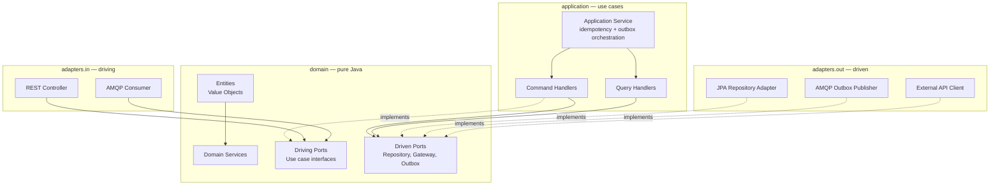

# Distributed Event-Driven Payment &amp; Order Processing Engine

> A production-grade backend showcase built with **Java 21** and **Spring Boot 3**, demonstrating how to solve the hard problems of a modern e-commerce / fintech platform: high traffic spikes, asynchronous transaction processing, partial network failures, concurrent data modifications, and strict consistency requirements under eventual consistency.

[](https://github.com/Kaksi3118/java-payment-order-engine/actions)
[](https://openjdk.org/)
[](https://spring.io/projects/spring-boot)
[](https://maven.apache.org/)
[](https://github.com/Kaksi3118/java-payment-order-engine)
[](./LICENSE)

---

## Current Status

The project is under active development, built stage by stage with verified commits. The table below tracks what's been built and what's next.

| Area | Status | Details |
| --- | --- | --- |
| Project scaffold | ✅ Done | Multi-module Maven reactor, hexagonal package layout, Maven Wrapper 3.9.9, `docker-compose.yml` (Postgres 17 + Redis 7 + RabbitMQ 3.13), `.gitignore`, `.editorconfig`, `.gitattributes`, PR template |
| Shared Kernel | ✅ Done | `Money` (HALF_EVEN), typed UUIDs (`OrderId`, `PaymentId`, `UserId`, `TransactionId`), `AggregateRoot`, `DomainEvent`, `EventOutbox` port |
| ArchUnit guardrails | ✅ Done | 8 active rules: domain purity (no Spring/JPA/Jackson/SLF4J), domain→application forbidden, domain→adapters forbidden, application→adapters forbidden, adapters.in→adapters.out forbidden, cross-context isolation (order↔payment↔identity) |
| Identity domain | ✅ Done | `User` aggregate (PENDING→ACTIVE→SUSPENDED/DEACTIVATED state machine), `Email`, `PasswordHash`, `Role`, `Roles`, `UserStatus`, `JwtTokens`, 3 domain exceptions, driving ports (`RegisterUserUseCase`, `AuthenticateUserUseCase`), driven ports (`UserRepository`, `PasswordHasher`, `JwtIssuer`) |
| Identity application | ✅ Done | `RegisterUserService` (transactional outbox orchestration), `AuthenticateUserService` (read-only, no user enumeration) |
| Identity security adapters | ✅ Done | `BcryptPasswordHasher` (BCrypt with randomized salt), `JwtIssuerAdapter` (RS256 JWT with access/refresh token split + `typ` discriminator), `SecurityConfig` (stateless OAuth2 resource server), `JwtConfig` (RSA-2048 keypair + encoder/decoder beans), `JwtProperties` (validated TTL config) |
| Identity persistence adapters | ✅ Done | JPA `UserEntity` + `UserRepositoryAdapter` (load-then-update preserving `@Version`), `OutboxEntity` + `OutboxAdapter` (JSON-serialized events with PENDING status), Flyway V1 migration (`users`, `user_roles`, `outbox_events`) |
| Identity REST controllers | ✅ Done | `AuthController` (`POST /api/auth/register` with `Idempotency-Key` header, `POST /api/auth/login`), `GlobalExceptionHandler` (domain exceptions → HTTP 409/401/403/400), Bean Validation on request DTOs |
| Identity integration tests | 🚧 Next | Testcontainers (real Postgres) end-to-end JWT roundtrip |
| Order bounded context | 📋 Planned | Outbox, idempotency, CQRS, optimistic + pessimistic locking, Redis distributed locks |
| Payment bounded context | 📋 Planned | External gateway client with Resilience4j (circuit breaker, retry, rate limiter) |
| RabbitMQ wiring | 📋 Planned | DLQ topology, outbox poller with Redis distributed lock |
| Observability | 📋 Planned | Micrometer + Prometheus + Grafana dashboards |
| CI/CD | 📋 Planned | GitHub Actions workflow |

**Test count:** 111 tests green (`./mvnw clean verify` → BUILD SUCCESS) — 34 shared-kernel + 69 identity + 8 ArchUnit architecture rules.

---

## Why this project?

Most portfolio backends are CRUD apps with a thin REST layer over JPA. This project intentionally reaches for the same architectural patterns used in production payment systems at scale, so that the hard parts — and how to reason about them — are visible in the code:

| Production challenge | How this project demonstrates it |
| --- | --- |
| Reliable event delivery without 2PC | **Transactional Outbox Pattern** — DB writes and event publication succeed or fail atomically; a poller drains the outbox to RabbitMQ. |
| Duplicate processing on client retry | **Idempotency-Key** header + persisted idempotency context for all state-changing financial operations (no double-charging). |
| Concurrent inventory / balance mutation | Multi-layer concurrency control: **JPA optimistic locking** (`@Version`) + **pessimistic locks** for hot paths, augmented by **Redis distributed locks** (Redisson). |
| Decoupling heavy work from the request path | **CQRS** + **asynchronous messaging via RabbitMQ** with explicit DLQ topologies and retry/backoff semantics. |
| Cascading failure from a flaky third-party API | **Resilience4j**: circuit breaker, bulkhead, rate limiter, retry — around the external payment gateway. |
| High throughput on a blocking I/O stack | **Java 21 virtual threads** (`spring.threads.virtual.enabled=true`) — JDK-level carrier scheduling, no reactive rewrite. |
| Trustworthy integration tests | **Testcontainers** spins up **real** PostgreSQL, Redis, and RabbitMQ in Docker — no in-memory mocks. |
| Boundary discipline at scale | **Hexagonal architecture** with **ArchUnit** tests that fail the build if the `domain` layer ever imports Spring/JPA. |

---

## Architecture

### High-level system topology


### Hexagonal / Ports &amp; Adapters (per bounded context)



---

## Tech Stack

| Concern | Choice |
| --- | --- |
| Language / Framework | Java 21 (records, pattern matching, virtual threads) + Spring Boot 3.4.1 |
| Persistence | PostgreSQL 17 + Flyway 10 (forward-only migrations) + Spring Data JPA |
| Caching &amp; distributed locks | Redis 7 + Redisson |
| Messaging | RabbitMQ 3.13 + Spring AMQP (with explicit DLQ topology) |
| Resilience | Resilience4j (circuit breaker, retry, rate limiter, bulkhead) |
| Security | Spring Security + JWT (stateless) + RBAC |
| Testing | JUnit 5, AssertJ, Mockito, Testcontainers (real Postgres/Redis/RabbitMQ), ArchUnit |
| Observability | Micrometer + Prometheus + Grafana dashboards |
| CI/CD | GitHub Actions |
| Build | Maven 3.9.x multi-module reactor (with Maven Wrapper) |

---

## Repository Structure

```
java-payment-order-engine/
├── pom.xml                         # parent reactor (BOM imports, plugin management)
├── docker-compose.yml              # PostgreSQL + Redis + RabbitMQ
├── shared-kernel/                 # cross-context primitives: Money, IDs, DomainEvent
├── modules/
│   ├── identity/                  # JWT auth + RBAC
│   ├── order/                     # order lifecycle, outbox, idempotency
│   └── payment/                   # payment + gateway client + Resilience4j
├── bootstrap/                     # Spring Boot main + wiring + application.yml
└── docs/architecture/             # ADRs + diagrams
```

Each bounded context module internally follows the same hexagonal package layout:

```
com.engine.<context>/
├── domain/
│   ├── model/        entities + value objects (pure Java, no framework imports)
│   ├── event/        domain events
│   ├── service/      pure domain services
│   └── port/
│       ├── in/       driving ports — use case interfaces (REST/AMQP call these)
│       └── out/      driven ports — repository, gateway, outbox interfaces
├── application/
│   ├── command/      CQRS write side — commands + handlers
│   ├── query/        CQRS read side — queries + read models
│   └── service/      orchestration: outbox dispatch + idempotency guard
└── adapters/
    ├── in/           REST controllers, @RabbitListener consumers
    └── out/          JPA repositories, AMQP publisher, external HTTP client
```

---

## Quick Start

### Prerequisites

- **Java 21** (Temurin recommended)
- **Docker** + Docker Compose (with the Docker daemon running)
- **Git**

> The Maven Wrapper (`./mvnw`) is bundled — you do **not** need a local Maven install.

### 1. Start the infrastructure

```bash
docker compose up -d
```

This spins up PostgreSQL (5432), Redis (6379), and RabbitMQ (5672 + management UI at http://localhost:15672 — login `poe` / `poe_dev_password`).

### 2. Build &amp; run the application

```bash
./mvnw clean verify          # runs unit + integration tests via Testcontainers
./mvnw -pl bootstrap spring-boot:run
```

The API is now available at `http://localhost:8080`.

### 3. Stop the infrastructure

```bash
docker compose down -v       # -v also drops the volumes for a clean slate
```

---

## Complex Engineering Problems — Solved

### 1. Transactional Outbox Pattern

Database updates and event publication must succeed or fail together. We do **not** use a JTA / 2PC distributed transaction — it is operationally complex and slow. Instead, every command writes its business state and an outbox row in the **same** local DB transaction. A separate poller leases outbox rows (using Redis distributed locks to ensure a single dispatcher across instances) and publishes them to RabbitMQ, marking each row `PUBLISHED` only after the broker confirms. At-least-once delivery + idempotent consumers = effectively-once processing.

### 2. Idempotency Pattern

All POST/PUT endpoints that mutate financial state accept an `Idempotency-Key` header. The application layer stores the key alongside the request hash and the resulting response. A replay of the same key returns the original result without re-executing the side effect — protecting against network retries and double-charging.

### 3. Concurrency Control

Three layers, each addressing a different failure mode:
1. **JPA `@Version` (optimistic locking)** — fails fast on stale reads; the request layer retries with backoff.
2. **Pessimistic `SELECT ... FOR UPDATE`** — for hot inventory rows where contention is high and retry is expensive.
3. **Redisson distributed lock** — the cross-instance coordinator for the outbox dispatcher and inventory flash sales.

### 4. CQRS

Writes (commands) and reads (queries) are segregated down to the handler level. This allows read models to be optimized independently (denormalized projection tables, Redis cache) and keeps the write side focused on consistency invariants.

### 5. Resilience4j around the external gateway

Circuit Breaker (transitions OPEN after a configurable failure rate, half-open to probe recovery), Retry (exponential backoff with jitter, only for idempotent or safely-retriable operations), and Rate Limiter (protect both us and the gateway from overload).

### 6. Virtual Threads

`spring.threads.virtual.enabled=true` makes Tomcat park blocked request threads on virtual carriers, so a blocking JPA/AMQP/Redis call does not consume a platform thread. Throughput rises dramatically without a reactive rewrite.

---

## Build Commands

```bash
./mvnw clean verify            # full build + integration tests (Testcontainers)
./mvnw -pl modules/order test  # tests for a single module
./mvnw -DskipTests package     # compile + package only
./mvnw dependency:tree         # inspect resolved versions
```

---

## Roadmap

- [x] **Stage 1** — Repository scaffold, hexagonal module layout, parent POM, `docker-compose.yml`, Maven Wrapper, repo-quality files.
- [x] **Stage 2** — Shared Kernel (`Money`, typed IDs, `DomainEvent`, `AggregateRoot`) + ArchUnit guardrails (8 rules).
- [x] **Stage 3a** — Identity domain layer (`User` aggregate, value objects, ports, events, state machine).
- [x] **Stage 3b** — Identity application layer (`RegisterUserService`, `AuthenticateUserService`, `EventOutbox` port).
- [x] **Stage 3c-i** — Identity security adapters (BCrypt hasher, RS256 JWT issuer, Spring Security config).
- [x] **Stage 3c-ii** — Identity persistence adapters (JPA entity + repository adapter, outbox entity + adapter, Flyway V1 migration).
- [x] **Stage 3c-iii** — Identity REST controllers + `Idempotency-Key` enforcement + global exception handler.
- [ ] **Stage 3c-iv** — Flyway migrations + Testcontainers integration tests.
- [ ] **Stage 4** — Order bounded context (outbox + idempotency + CQRS + concurrency control).
- [ ] **Stage 5** — Payment bounded context (Resilience4j gateway client + retries).
- [ ] **Stage 6** — RabbitMQ wiring (DLQ topology + outbox poller).
- [ ] **Stage 7** — Observability (Prometheus + Grafana).
- [ ] **Stage 8** — GitHub Actions CI.

---

## License

[MIT](./LICENSE) — feel free to use this as a reference, but please don't claim it as your own portfolio work without attribution.